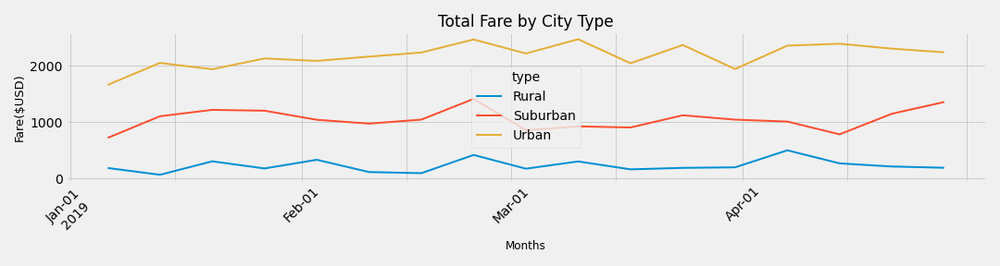

# PyBer_Analysis
#### This analysis will provide brief summary and data visualization to PyBer company regarding total weekly fares for each city type. With knowledge of Pandas and Matplotlib in Python, a summary dataframe of ride-sharing data by city type is generated, and output into a simple graph for visulization that showcases total weekly fares for individual city type. 
---

#### Overview of analysis:
- Explain the purpose of the new analysis.
  - This analysis will provide basic insight on total fares by each city type. There are three types of city in our city data - Rural, Suburban, and Urban. There are also a ride data where it includes time, fare, city, and ride_id. Analysis was able to merge two datasets, and provide summary regarding total rides, total drives, total fares, average fare per ride, and average fare per driver based on different city type. Finally, a line chart is created to provide visualization on the total fare differences between each city types. 
  
#### Results:
- Using images from the summary DataFrame and multiple-line chat, describe the differences in ride-sharing data among different city types. 
  - Below is brief summary of information based on different city types. It is obvious that in urban area, there are significantly large amount of total rides (1,625) and total drivers (2,405), and the average fare cost per ride (\$24.53) is the lowest comparing to other city type. Furthermore, urban area has the lowest average fare pay per driver ($16.57).

 - Below is a multi-line chart that shows the overall total fare for each of the city type. Urban's line is at the top, which showcases that in the urban area it has the highest total fare over the course of January to April in 2019.  

#### Summary:
- Based on the results, provide three business recommendations to the CEO for addressing any disparities among the city types.
  - Looking at the graph, it does seem like there is a slight increase in the total fare in all city type at the end of Februray. I would personally recommend providing promotions or incentives around this time to increase volumes of potential customesr. 
  - Based on the dataframe summary, I would also recommend to shift portion of the drivers in urban area to cover the rural area. The logistic behind this recommendation is that there are excessively large number of drivers in urban region. With this shift, there might be bigger profit not only to the drivers, but also to PyBer company. 
  - Last but not least, the average fare per driver in urban area is relatively low compared to the others. This, potentially, is due to short distance of trips. One business strategy to compensate urban drivers is to provide bonuses after certain amount of rides are accomplished. This will encourage drives, and boost the overall profit to the company. 

